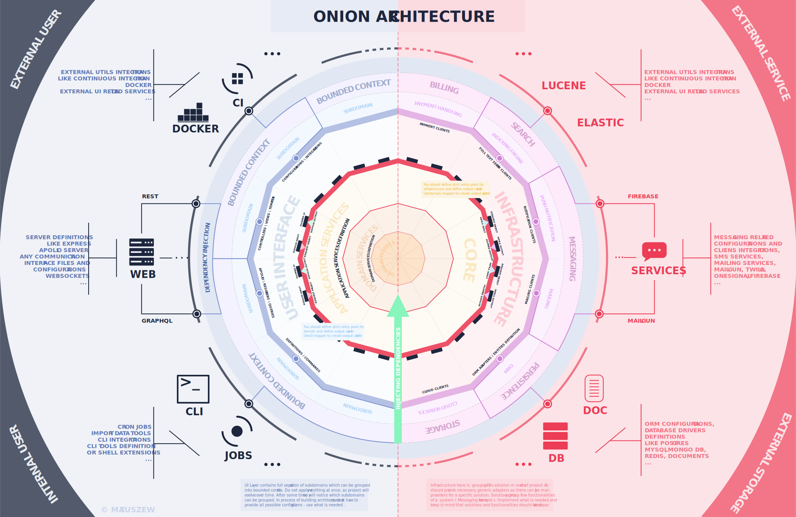

# Onion Architecture Boilerplate

### DESCRIPTION

This repository is a real life example of Onion Architecture with use of `Node.js / Express` and `Typescript`

Diagram available [here](https://drive.google.com/uc?export=view&id=1BPV_0a7QHWHAfEDDMUkKpMELM0PruiEs)

> This diagram has some copyrights, if you want to use it on larger scale, feel free to contact me.

##### Technologies used

1. `Typescript` ( `v3.7.5` )
2. `Inversify.js`
3. `TypeOrm`
4. `Express.js`
5. `Mocha / Chai` for testing

##### Structure

1. core ( `Application Core` )
    
        Contains application core related layers like application services, domain and domain services
        
2. dependency ( `Dependency injection layer` )

        Contains definition for Container and whole project dependencies
        
3. infrastructure 

        Contains definition of data sources in case of this boilerplate - database
        
4. ui

        Contains definition of presentation layer like controller, express setup etc  
        
##### What is supported?

1. Multiple environment setup
2. DB Agnostic setup, supports multiple datasource
3. Infrastructure -> Domain Mapping -> UI Mapping
4. Migrations, Fixtures, Seeds   
5. Multiple API versions support ( REST implementation )
6. Global Error Handling
7. Test Parallelization           

##### Reference

Inspired by following articles:

https://dev.to/remojansen/implementing-the-onion-architecture-in-nodejs-with-typescript-and-inversifyjs-10ad

https://herbertograca.com/2017/11/16/explicit-architecture-01-ddd-hexagonal-onion-clean-cqrs-how-i-put-it-all-together

https://www.slideshare.net/matthidinger/onion-architecture

### PREREQUISITIES

* `Yarn`
* `NVM` ( tested on `v10.13.0+`)
      
      wget -qO- https://raw.githubusercontent.com/nvm-sh/nvm/v0.34.0/install.sh | bash`
* `PostgreSQL` ( tested on `v11+`)

### SETUP

1. **Database**
    * Look at the `ormconfig.sample.js` file. It's a sample setup of database connection,
      you can provide your own data for database if needed. From app perspective you have to manually
      create database for development ( in sample with name `onion_dev` ) and for testing `onion_test`.
    * Migrations will autorun on application start 
2. **Env Variables**
    * `.env.example` contains example env config - for local / dev use you can use same values as provided
       in sample
    * for production use generate token with following command
    
            node -e "console.log(require('crypto').randomBytes(256).toString('base64'));"   
       
### HOW TO RUN LOCALLY

1. Follow `SETUP` section first and install `PREREQUISITIES`
2. `Yarn install` - installing dependencies
3. `Yarn dev` - run app with watch and rebuild

### WORKING WITH DATABASE

1. To prepare database with latest migrations run `yarn db:reload`,
   it also removes all data from db and recreates it. Useful when playing with seed data.
2. To seed database run `yarn db:seed`   
2. To generate migration based on changes in entity object run `yarn db:generate <my_migration_name>`

### SWAGGER

When there is a swagger host provided in `.env` file then you can navigate to `http://localhost:3000/api-docs/`

Update `swagger.json` file located at `ui > config` every time you apply changes to api.
          
### TESTING

1. Prepare tests database first ( `SETUP SECTION` )
2. Run `yarn test` - should run mocha tests in parallel

#### Mutational Testing

1. Read guide [here](https://stryker-mutator.io/stryker/quickstart) to setup global dependencies
2. Run `yarn test:mutate` command

### APPLIED CONCEPTS

There are some universal concepts in programming ( designed patterns ) which are common for general engineering but
it's not always obvious how to use environment specific concepts. In this boilerplate I'm going to show how to handle that.

#### Request Object

Request object defines parameters / input to specific module input ( domain / infrastructure ), and holds
required data which cannot be changed on the fly.

#### Mapper

Simple concept where one module data structure is translated to another module

##### Infrastructure -> Domain Mapper

This mapper is prepared for mapping data source format data into domain format. Simplest example would be that, in 
database we store `first_name` and `last_name` in separate columns, but in domain we need to have field `name` which
is combined value of previously mentioned columns. In that case we define domain model with required fields and new `name` field.
In Mapper we can perform merging of those 2 values. Thanks to that we can have separation
between definition of Entity and Domain, and also we have just plain values in domain object instance without
any overhead related to persistence data etc, which for sure would be stored by Entity object instance. We can also calculate
simple values in mappers etc. 

##### Domain -> UI Mapper 

This mapper is for preparing Domain data format into specific ui data format. Sometimes we may need to perform
some logic in domain services on domain object format but we would like to make a response in totally different format.
For example we may fetch data as array from database, perform operations in services on array but on ui, we would like to
group array elements into map structure in different format. In repository we mapped `User` domain object into `User` ui object
where `UI` object do not contain password field and contains only required fields for authentication purposes.

#### Migrations

Used for managing database changes. In repository we generate migrations based on entity changes. So we can
add new column on entity and then just use one command to generate required migration. It's recommended to split database related
changes into multiple migrations instead creating one migration for all related feature changes. For example it's better to
have separate migration for creating `x` table and separate migration for adding / updating table columns definition to
table `y`.

#### Seeds

Used for local development or testing - it's just data for specific use cases which can be also used for dev
environment where QA's can test specific endpoints or screens. It's also useful as start data for local development 
especially when you are working as a full stack.

#### Tests parallelization

Every test runs on it's separate database and we can spawn multiple tests at the same time,
and run in transaction specific test cases, thanks to which we don't have to clear db after running every test.

#### Mutational testing

Mutational testing is integrated with `Mocha` test runner and shows how many mutations are still available in 
system, and where we should apply additional test coverage.

#### Integration testing

We are testing whole layers data flow - from `UI` layer up to `Infrastructure`. We are testing
not only responses but also saved data in database and authentication context.

### STILL TODO

* Prepare FP version of architecture - separate repo
* Introduce Graphql and integration with inversify-graphQL - separate repo
* On complete update `CHANGELOG.MD` and tag v1

### KNOWN ISSUES

* Seeds issue - currently using external repository with patch, when this PR is merged move to newest version
  `https://github.com/w3tecch/typeorm-seeding/pull/18`

* To authenticate provide token this way as swagger 2.0 do not support bearer strategy 
  `https://github.com/OAI/OpenAPI-Specification/issues/583#issuecomment-267554000`

* http context is empty in controllers, looks like http context is incorrectly injected into controller,
  everything is fine though in middlewares - applied workaround take a look at `getCurrentUser` helper
  
* bcrypt do not support worker threads - follow [this](https://github.com/kelektiv/node.bcrypt.js/issues/709) issue.
  As long as it's not closed, stay with applied version in package ( this issue is related to 
  parallelization of mocha tests )
