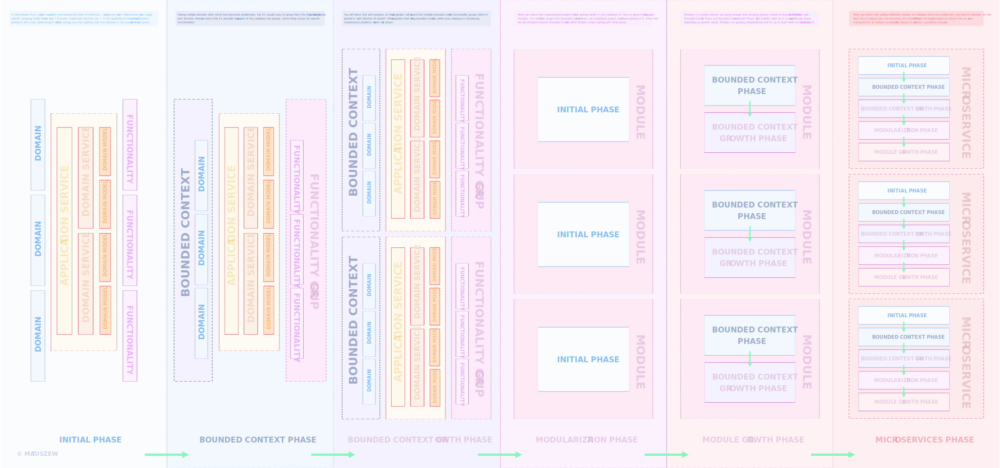

# Onion Architecture Boilerplate

### DESCRIPTION

This repository is a real life example of Onion Architecture with use of `Node.js / Express` and `Typescript`

Diagram available [here](https://drive.google.com/uc?export=view&id=1900T-IpU1bZR9VdoncC822qZCwcrgUOY)

> Diagrams have copyrights, if you want to use it on larger scale, feel free to contact me.

### BUSINESS CONTEXT

Project is a simple simulator of warehouse and managing storage space. 
There are two separate perspectives `Administrative` and `Client` facing app.

##### Scenarios

#### Portal - Client facing app

    --------- CLIENT PERSPECTIVE ---------

    Given that I'm not a Client
    And I would like to create account
    When I provide required data
    Then my account is created

    Given I'm not authenticated Client 
    And I would like to authenticate
    When I provide proper authentication details
    Then I'm able to get into system

    Given I'm authenticated Client 
    And I would like to delete account
    When I perform delete action
    Then I'm no longer able to authenticate

    Given I'm authenticated Client
    When I get into my profile
    Then I can see my account data

    Given I'm authenticated Client
    And I would like to create equipment
    When I provide all required data
    Then Equipment is created

    Given I'm authenticated Client
    And I have equipment
    When I select Warehouse
    Then I receive price preview

    Given I'm authenticated Client
    And I have multiple equipment items
    Then I can preview it

    Given I'm authenticated Client
    Then I can preview available Warehouses

    Given I'm authenticated Client
    And I have equipment
    When I select Warehouse
    And perform store item action
    Then I receive Warehouse Item with cost included

    --------- Admin PERSPECTIVE ---------

    Given I'm authenticated Admin
    Then I can preview all equipment
    And Users related to equipment
    
    Given I'm authenticated Admin
    And I would like to create equipment
    When I provide required data
    Then Equipment is created

    Given I'm authenticated Admin
    Then I can preview all warehouses
    And related Warehouse Items

    Given I'm authenticated Admin
    Then I can preview specific warehouse
    And related Warehouse Items

    Given I'm authenticated Admin
    And I would like to create new Warehouse
    When I provide all required data with State
    Then Warehouse is created

    Given I'm authenticated Admin
    And there is existing Warehouse
    When I provide new data with State
    Then Warehouse data is updated

    Given I'm authenticated Admin
    And there is existing WarehouseItem
    Then I can preview it

    Given I'm authenticated Admin
    And there are many existing WarehouseItems
    Then I can preview all of them

    Given I'm authenticated Admin
    And I would like to create new WarehouseItem
    When I provide all required data with Warehouse
    Then WarehouseItem is created

    Given I'm authenticated Admin
    And there is existing WarehouseItem
    When I provide new data with Warehouse
    Then WarehouseItem is updated

    Given I'm authenticated Admin
    Then I can preview all Users

    Given I'm authenticated Admin
    Then I can preview all States
    And related Rates

    Given I'm authenticated Admin
    Then I can preview all Rates

##### Technologies used

1. `Typescript` ( `v3.7.5` )
2. `Inversify.js`
3. `TypeOrm`
4. `Express.js`
5. `Apollo Server`
6. `GraphQL`   
7. `Mocha / Chai` for testing

##### Structure

1. core ( `Application Core` )
    
        Contains application core related layers like application services, domain and domain services
        
2. dependency ( `Dependency injection layer` )

        Contains definition for Container and whole project dependencies
        
3. infrastructure 

        Contains definition of data sources in case of this boilerplate - database
        
4. ui

        Contains definition of presentation layer like controller, express setup etc  

##### Data flow

It's important to keep data flow as simple as possible. Generally it's simple to follow - for entry data always specify request object,
for output translate data to specific layer. For easier understanding I've prepared a diagram.

Diagram available [here](https://drive.google.com/uc?export=view&id=1cpdb56cnzkxT_LA_NSW9aRFDDcS_3GFl)

##### Architecture layers access restrictions

Every layer has its own rules when it comes to access to another layer. 

* `Dependency injection` has access to every layer to provide proper implementations.
* `UI` have access only to `Core Layer`
    * `Domains` can be grouped into `Bounded Context`
    * Given `Domains` do not see each other, but defines `protocol` of communication like `CLI`, `REST` etc.
* `Infrastructure` have access only to `Core Layer`
    * `Functionalities` can be grouped into `Functionality Group` like `Messaging`, `Persistence` etc
    * Given `Functionalities` do not see each other, but have access to `Data Source`
* `Core Layer` don`t have access to any layer. It means that it's fully independent of implementations and can be
   extracted from project if needed
    * `Application Service` here have access to `Domain Services` and `Domain Models`
    * `Domain Serivce` have access only to domain models, and `Domain Services` don`t see one each other
    * `Domain Model` don`t have access to any upper layer

Visual representation of above restrictions can be seen in a diagram.

Diagram available [here](https://drive.google.com/uc?export=view&id=1xonZCgIalsW1UCBqusK6Rqz5__I0-T8p)

##### Architecture Growth Lifecycle

It's natural that every project evolve with time. From my perspective process of growth can be divided into specific phases.

* Initial Phase
    * Introducing `Onion Architecture` to project by `layering` codebase - separating code into `UI`, `CORE`, `INFRASTRUCTURE` layers
* Bounded Context Phase
    * Grouping domains into `Bounded Contexts`
* Bounded Context Growth Phase
    * Separating whole project into `Multiple Bounded Contexts`
* Modularization Phase
    * Dividing Project into `Modules`. Usually you will notice that you can rollback your code to `Initial Phase` as modules are separation was
      based on `Bounded Contexts`
* Modularization Growth Phase
    * Every `Module` evolve in its own pace up to `Bounded Context Growth Phase`. You may have also `Common Module` which is shared across other modules.
* Microservices Phase
    * After some time you may notice that having multiple modules within one codebase is too much, or you may se that specific module is a potential candidate to `Microservice`.
      If you decide to detach `Module` into `Microservice` you may start application lifecycle from the beginning or from any phase you like up to `Modularization Growth Phase`. 
      You may even start from initial phase and move through all the phases within specific `Microservice`. Every `Microservice Architecture lifecycle` is independent ( like in `Modularization Growth Phase`)

Visual representation of above process can be seen in a diagram.

Diagram available [here](https://drive.google.com/uc?export=view&id=1GkY_vOUCXxVce-6Ajz1Zlj1pVMwhJ9d1)

##### What is supported?

1. Multiple environment setup
2. DB Agnostic setup, supports multiple datasource
3. Infrastructure -> Domain Mapping -> UI Mapping
4. Migrations, Fixtures, Seeds   
5. Multiple API versions support ( REST implementation )
6. Global Error Handling
7. Test Parallelization
8. Multiple protocols within one codebase ( GraphQL / REST )

##### Reference

Inspired by following articles:

https://dev.to/remojansen/implementing-the-onion-architecture-in-nodejs-with-typescript-and-inversifyjs-10ad

https://herbertograca.com/2017/11/16/explicit-architecture-01-ddd-hexagonal-onion-clean-cqrs-how-i-put-it-all-together

https://www.slideshare.net/matthidinger/onion-architecture

### PREREQUISITIES

* `Yarn`
* `NVM` ( tested on `v10.13.0+`)
      
      wget -qO- https://raw.githubusercontent.com/nvm-sh/nvm/v0.34.0/install.sh | bash`
* `PostgreSQL` ( tested on `v11+`)

### SETUP

1. **Database**
    * Look at the `ormconfig.sample.js` file. It's a sample setup of database connection,
      you can provide your own data for database if needed. From app perspective you have to manually
      create a database for development ( in sample with name `onion_dev` ) and for testing `onion_test`.
    * Migrations will autorun on application start 
2. **Env Variables**
    * `.env.example` contains example env config - for local / dev use you can use same values as provided
       in sample
    * for production use generate token with following command
    
            node -e "console.log(require('crypto').randomBytes(256).toString('base64'));"   
       
### HOW TO RUN LOCALLY

1. Follow `SETUP` section first and install `PREREQUISITIES`
2. `Yarn install` - installing dependencies
3. `Yarn dev` - run app with watch and rebuild

### WORKING WITH DATABASE

1. To prepare a database with the latest migrations run `yarn db:reload`,
   it also removes all data from db and recreates it. Useful when playing with seed data.
2. To seed database run `yarn db:seed`   
2. To generate migration based on changes in entity object run `yarn db:generate <my_migration_name>`

### SWAGGER

When there is a swagger host provided in `.env` file then you can navigate to `http://localhost:3000/api-docs/`

Update `swagger.json` file located at `ui > config` every time you apply changes to api.

### GraphQL Playground

Navigate to `http://localhost:3000/graphql` to make queries through `GraphQL` playground
          
### TESTING

1. Prepare tests database first ( `SETUP SECTION` )
2. Run `yarn test` - should run mocha tests in parallel

#### Mutational Testing

1. Read guide [here](https://stryker-mutator.io/stryker/quickstart) to setup global dependencies
2. Run `yarn test:mutate` command

### APPLIED CONCEPTS

There are some universal concepts in programming ( designed patterns ) which are common for general engineering, but
it's not always obvious how to use environment specific concepts. In this boilerplate I'm going to show how to handle that.

#### Request Object

Request object defines parameters / input to specific module input ( domain / infrastructure ), and holds
required data which cannot be changed on the fly.

#### Unit Of Work

Unit Of Work is simply speaking - a wrapper. It wraps repositories and performs required operations usually in transaction.
It solves issue related to circular repository dependency in ioc, or nested repository dependency on each other. With unit 
of work specific repository methods don't have any reference to external repositories which makes them more atomic.

#### Interactor / UseCase / Scenario

`Interactor` is a single, independent action to execute in any place of the system. It contains logic related to specific problem ( usually also to specific domain )
and can be shared across multiple domains. It has clear input definition and output. The idea of `interactor` is to avoid need of nesting 
`services` in each other. If you need to nest `services` then you also combine domains, and you will face cross domain issues. As `interactor` is
independent operation to reuse, it **CANNOT** have `service` as dependency ( `repository` is allowed ). It can be injected into `service` though.

`UseCase` you can see it as a wrapper, if you have business use case which depends on multiple `interactor `results, and you need to apply some logic on those results,
then `UseCase` is a way to go. `UseCase` may have multiple `interactors` as dependencies + `repositories`.

`Scenario` is a wrapper around `UseCases`. Same way of thinking as in `UseCase` - if you have a complex, reusable across multiple domains / modules operation, which depends
on multiple `UseCases`, `Interactors`, `repositories` results, and you need to apply specific logic on those results, then `scenario` is a way to go.

All of those patterns should be presented as single action to execute - there shouldn't be multiple methods / functions applied to their interfaces, just `execute`.

#### Mapper

The Simple concept, where one module data structure is translated to another module

##### Infrastructure -> Domain Mapper

This mapper is prepared for mapping data source format data into domain format. The Simplest example would be that, in 
a database we store `first_name` and `last_name` in separate columns, but in a domain we need to have field `name` which
is combined value of previously mentioned columns. In that case we define domain model with required fields and new `name` field.
In a Mapper, we can perform merging of those 2 values. Thanks to that we can have separation
between definition of Entity and Domain, and also we have just plain values in domain object instance without
any overhead related to persistence data etc, which for sure would be stored by Entity object instance. We can also calculate
simple values in mappers etc. 

##### Domain -> UI Mapper 

This mapper is for preparing Domain data format into specific ui data format. Sometimes we may need to perform
some logic in domain services on domain object format, but we would like to make a response in totally different format.
For example, we may fetch data as array from a database, perform operations in services on an array but on `UI`, we would like to
group array elements into map structure in a different format. In a repository, we mapped `User` domain object into `User` ui object
where `UI` object do not contain password field and contains only required fields for authentication purposes.

#### Migrations

Used for managing database changes. In a repository, we generate migrations based on entity changes. So we can
add a new column on entity and then just use one command to generate required migration. It's recommended to split database related
changes into multiple migrations instead creating one migration for all related feature changes. For example, it's better to
have separate migration for creating `x` table and separate migration for adding / updating table columns definition to
table `y`.

#### Seeds

Used for local development or testing - it's just data for specific use cases which can be also used for dev
environment where QA's can test specific endpoints or screens. It's also useful as start data for local development 
especially when you are working as a full stack.

#### Tests parallelization

Every test runs on it's separate database, and we can spawn multiple tests at the same time,
and run in transaction specific test cases, thanks to which we don't have to clear db after running every test.

#### Mutational testing

Mutational testing is integrated with `Mocha` test runner and shows how many mutations are still available in 
system, and where we should apply additional test coverage.

#### Integration testing

We are testing whole layers data flow - from `UI` layer up to `Infrastructure`. We are testing
not only responses but also saved data in database and authentication context.

### STILL TODO

* Prepare FP version of architecture - separate repo
* Introduce the `Docker` into project  
* Improve IOC implementation ( some injections do not have dependencies, so we can define it as pure functions )
* Prepare testing infrastructure for `GraphQL` endpoints
* Provide example of project modularization ( `lerna` + `yarn workspaces` )
* Resolve `TODO's` comments  
* Provide additional diagrams
    * Database diagram
    * Detailed diagram per layer

### KNOWN ISSUES
* To authenticate provide token this way as swagger 2.0 do not support bearer strategy 
  `https://github.com/OAI/OpenAPI-Specification/issues/583#issuecomment-267554000`

* http context is empty in controllers, looks like http context is incorrectly injected into controller,
  everything is fine though in middlewares - applied workaround take a look at `getCurrentUser` helper
